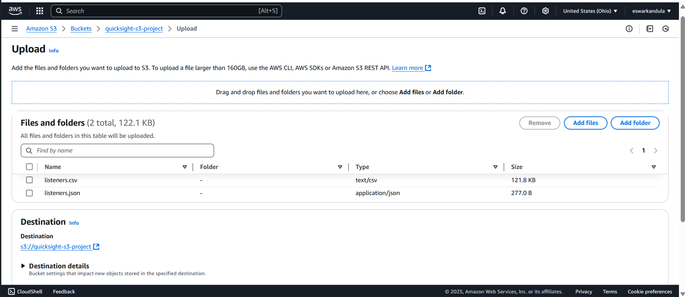

# Unlocking Data Insights with AWS QuickSight and Amazon S3

## Introduction
In today’s data-driven world, turning raw data into actionable insights is crucial. AWS QuickSight, when integrated with Amazon S3, provides powerful visualization capabilities. This guide walks through setting up AWS QuickSight with S3, uploading datasets, and creating compelling visualizations.

## Prerequisites
Before getting started, ensure you have the following:
- An **AWS Account** (Free-Tier available)
- Dataset files: `listeners.csv` and `listeners.json`
- Basic familiarity with AWS services

## Step 1: Creating an S3 Bucket and Uploading Data
1. Log in to AWS and search for **S3** in the AWS Console.
2. Click **Create Bucket**, provide a unique name, and select a region.
3. 
4. Keep the default settings and click **Create Bucket**.
5. Open your newly created bucket and click **Upload**.
6. Add `listeners.csv` and `listeners.json` files and upload them.
7.  
8. Verify that the files are successfully uploaded.

### Example Manifest File
Modify the `listeners.json` manifest file to match your bucket name:
```json
{
   "fileLocations": [
       {
           "URIs": [
               "s3://your-bucket-name/listeners.csv"
           ]
       }
   ],
   "globalUploadSettings": {
       "format": "CSV",
       "delimiter": ",",
       "textqualifier": "\"",
       "containsHeader": "true"
   }
}
```

## Step 2: Setting Up AWS QuickSight
1. In AWS Console, search for **QuickSight** and open it.
2. Click **Sign Up for QuickSight** (if not already signed up).
3. Choose **Enterprise Edition** (30-day free trial available).
4. Select authentication method, set a username, and enter an email.
5. Under **Access Permissions**, allow access to your S3 bucket.
6. Click **Finish** and wait for QuickSight to set up.

## Step 3: Connecting QuickSight to S3 Data
1. In QuickSight, go to **Datasets** and click **New Dataset**.
2. Select **S3** as the data source.
3. Provide a name and paste the **S3 URI** of `listeners.json`.
4. Click **Connect**, then **Visualize**.
5. If access issues arise, update QuickSight permissions for S3.

## Step 4: Creating Data Visualizations
1. Once the dataset is loaded, select **Fields** for visualization.
2. Drag `Artists` and `Listeners` to create a bar chart.
3. Apply filters
4. Experiment with different **chart types** and **custom metrics**.
5. 
6. 

## Additional Enhancements
- **Dashboards**: Combine multiple visualizations.
- **Custom Calculations**: Use QuickSight’s formula editor.
- **Performance Optimization**: Monitor and optimize dashboard performance.

## Conclusion
AWS QuickSight seamlessly integrates with Amazon S3, offering scalable and powerful data visualization. Experiment with different datasets and features to maximize insights.


   ```


